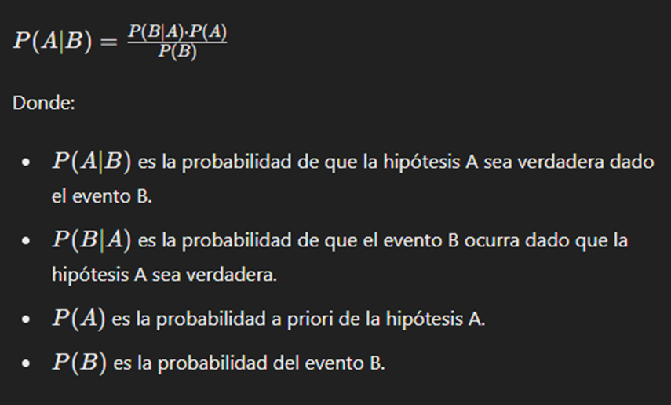

# Redes de Bayes y como lo implementan en probabilidad de enfermedad con sintomas 
# codigo basico



Concepto de Bayes:  Se basa en el teorema de Bayes, que establece cómo actualizar la probabilidad de una hipótesis dados nuevos datos o evidencia. 


•	Los hechos son los datos ingresados por el usuario en las entradas de texto. 
•	Las reglas están representadas por las CPDs definidas para cada nodo en el modelo de red bayesiana. 
•	La inferencia se realiza utilizando el modelo y los datos de entrada para calcular la probabilidad de la enfermedad. 
•	La base de conocimientos se compone del modelo de red bayesiana y las CPDs que se definen en el código.


## Instalación

Para instalar las dependencias del proyecto, primero asegúrate de tener Python y pip instalados en tu sistema. Luego, puedes instalar las dependencias ejecutando el siguiente comando en tu terminal:

```bash
pip install -r requirements.txt
